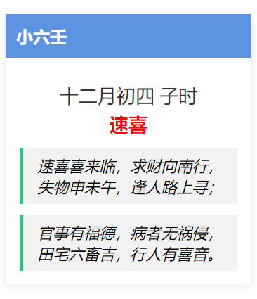

# 6ren
通过小六壬来预测事件。

## 获取农历数据
执行如下代码可从香港天文台获取农历数据，然后保存到`\lunar\data`目录的对应`1901-2100`年的`.json`文件中。
```cmd
cd lunar
python lunar.py
```
项目中已经包含了`1901-2100`年的`.json`文件，如果不需要更新数据，可以跳过这一步，直接获取数据使用即可。

## 使用农历数据
以`1901年02月04日`数据为例，可以读取`\lunar\data`文件夹中的`1901.json`文件。

当日的数据格式如下，其中：

`gan_zhi`是干支；`chinese_zodiac_sign`是生肖；`solar_term`是节气。

1901年1月20日之前的`month`为空，因为不确定是否为闰月情况，故未补充。估计应为`十一月`，如有需要可自行补充。
```
{
    ...,
    "02-04": {
        "gan_zhi": "辛丑",
        "chinese_zodiac_sign": "牛",
        "month": "十二月",
        "day": "十六",
        "week": "星期一",
        "solar_term": "立春"
    },
    ...
}
```

P.S. 由于数据来源于香港天文台，故数据中所涉及中文均为繁体字。如有需要，请自行转换。

## 获取六壬结果
```cmd
cd python
python 6ren.py
```
输出结果如下：
```cmd
十二月初三 亥时
大安
断曰：大安事事昌，求财在坤方，失物去不远，宅舍保安康。行人身未动，病者主无妨，将军回田野，仔细兴推祥。
```

## chrome插件
### 安装
执行如下代码：
```cmd
cd plugin
npm install
npm run build
```
然后在chrome中打开`chrome://extensions/`，点击左上方`加载已解压的扩展程序`，选择`plugin/build`目录下对应的`plugin-v版本号`文件夹即可。
## 使用
点击浏览器右上角的插件图标，然后在弹出的页面中点击起卦按钮，即可获取六壬结果。


结果展示如下：



## IOS小组件
### 使用
在iphone中，将`widget`文件夹下的`6ren.js`文件夹拷贝到`Scriptable`App中，然后添加小组件即可。小组件展示如图：


## 补充说明
卜算之事，玄而又玄，自行斟酌。

一事一卦，多测不灵。

预测结果仅供参考。

